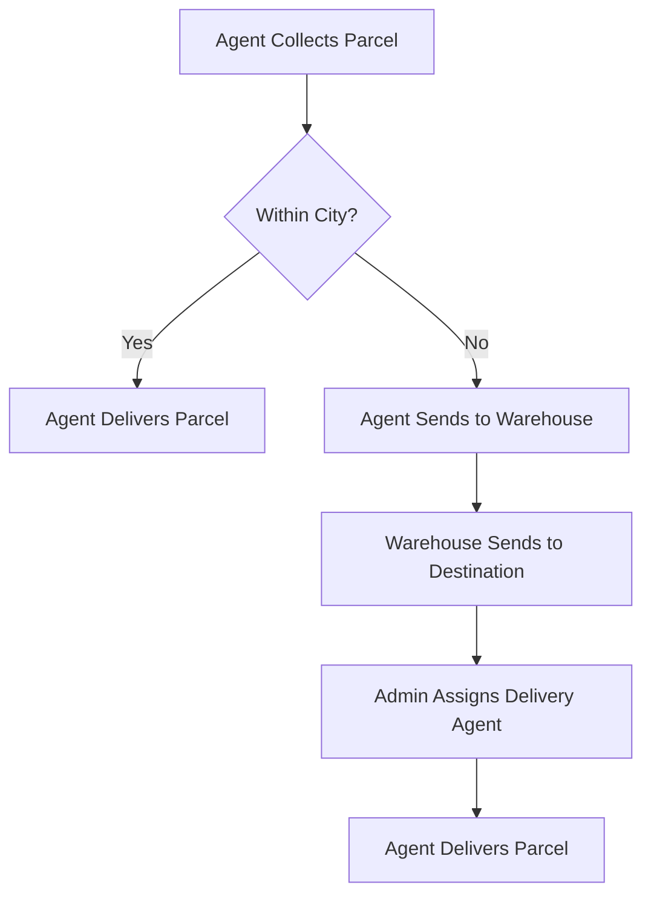

# 🚚 Rider-Parcel-Delivery System

A full-stack delivery management platform for handling parcel creation, rider assignments, user management, and real-time delivery tracking with secure payments.

## 🌐 Live Demo

**Frontend:** [https://zap-shift-da723.web.app/](https://zap-shift-da723.web.app/)

---

## 🖥️ Frontend

# Zap Shift Resources

Welcome to **Zap Shift Resources**!  
A curated collection of tools, guides, and assets for developing robust parcel management systems.

---

## 📊 System Overview Table

| Role               | Key Responsibilities                                                                      | Earnings/Benefits                              |
| ------------------ | ----------------------------------------------------------------------------------------- | ---------------------------------------------- |
| **Merchant**       | - Book parcels<br>- Pay charges<br>- Track status<br>- Review service                     | - Real-time tracking<br>- Feedback opportunity |
| **Admin**          | - Assign agents<br>- Manage routing<br>- Oversee warehouses<br>- Monitor operations       | - System control<br>- Operational oversight    |
| **Delivery Agent** | - Collect/Deliver parcels<br>- Update status<br>- OTP confirmation<br>- Warehouse handoff | - ৳20 per delivery                             |

---

## 🛒 Pricing Structure

| Parcel Type      | Weight    | Within City | Outside City/District |
| ---------------- | --------- | ----------- | --------------------- |
| **Document**     | Any       | ৳60         | ৳80                   |
| **Non-Document** | Up to 3kg | ৳110        | ৳150                  |
| **Non-Document** | >3kg      | +৳40/kg     | +৳40/kg +৳40 extra    |

---

## 🚚 Delivery Workflow



---

## 🗂️ Key Features

- **Automated Pricing & Tracking**
- **Role-based Access & Workflow**
- **OTP-based Secure Delivery**
- **Nationwide Coverage (64 districts)**
- **Transparent Commission Structure**

---

---

### Tech Stack

- **React.js**
- **React Router**
- **Tailwind CSS** + **DaisyUI**
- **Firebase Authentication**
- **Axios**
- **Stripe Payment**
- **Framer Motion**
- **React Hook Form**

### Key Features

- 🔐 Secure login with **Email/Password** & **Google**
- 🧭 Role-based dashboards: **Admin**, **User**, **Rider**
- 📦 Create parcels and assign riders
- 🚴 Track delivery status in real-time
- 💳 Stripe-integrated payment system
- ✅ Booking approval system and status updates
- 📬 Announcement system per user role
- 🔍 Rider parcel list and delivery status update
- 📱 Fully responsive & animated UI

### Installation

```bash
cd client
npm install
npm run dev
```

⚙️ Backend
Tech Stack
Node.js

Express.js

MongoDB + Mongoose

Firebase Admin SDK

JWT (JSON Web Tokens)

Stripe

CORS

Dotenv

Features
🔐 JWT + Firebase token verification middleware

📦 REST APIs for parcels, users, riders, payments, announcements

🧑 Promote/demote admin roles

💰 Track payments & rider cash-outs

🚚 Rider status update API

## Folder Structure

server/
├── controllers/
├── routes/
├── middlewares/
├── models/
├── utils/
├── .env
└── server.js


## Installation

`
cd server
npm install
npm run start
`

# 🔐 Environment Variables
## Frontend .env
```
VITE_FIREBASE_API_KEY=your_api_key
VITE_FIREBASE_AUTH_DOMAIN=your_auth_domain
```

## Backend .env
``
PORT=5000
MONGODB_URI=your_mongodb_uri
STRIPE_SECRET_KEY=your_stripe_key
``

👥 Roles
User – Create and track parcels

Rider – View assigned parcels and update status

Admin – Manage all users, parcels, and riders

🖼️ Screenshots
Add app screenshots or a video demo here

📜 License
This project is open source and available under the MIT License.


---

Let me know if you'd like a **markdown version split into two files** (frontend & backend), or if you want help writing a **short project summary for your portfolio or Behance**.


